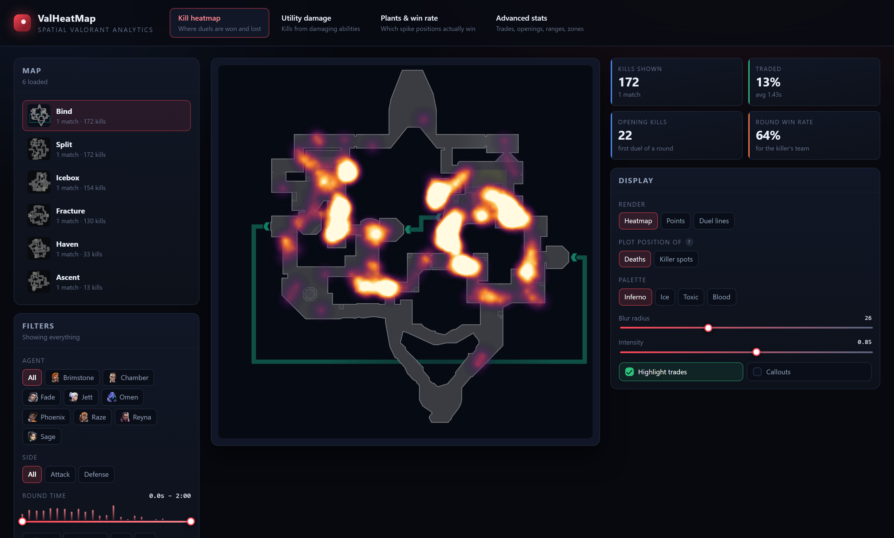
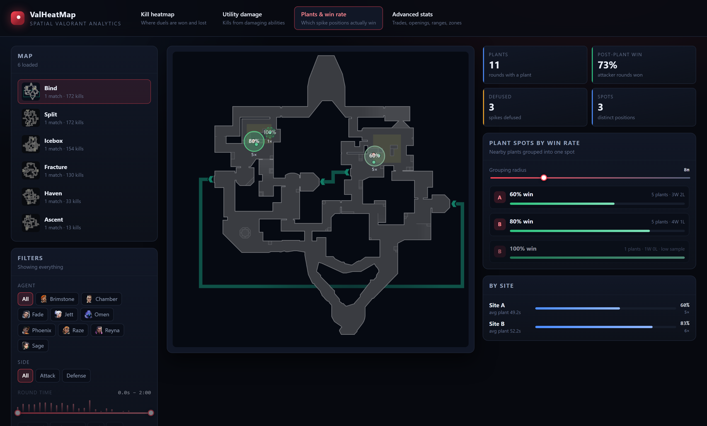

# ValHeatMap

Spatial Valorant analytics — kill heatmaps, utility-damage maps, plant
heatmaps and **plant-spot win rates**, with agent filters, a round-time
scrubber and trade detection.

The point of this project is the stats other trackers don't show. Sites like
tracker.gg tell you a player's K/D; they don't tell you *where* on Ascent
that player keeps dying untraded, which plant position actually wins the
round, or how much of a Viper's damage converts into kills.



## What it shows

**Kill heatmap** — every duel plotted on the real minimap, filterable by
agent, side, round window and weapon. A dual-handle time slider scrubs the
round, with a kill-density strip so you can see when the fights happen.
Plot either where people died or where the killers stood.

Density is accumulated into a float grid rather than into canvas pixels.
That distinction matters at scale: canvas alpha clamps at 1.0, so with
~20k points the busy areas saturate more than 100x over and every bit of
structure is destroyed *before* it can be normalised — the result is a
featureless white blob. Accumulating in floats preserves the full range,
and the colour scale is then set from a high percentile of the density
(not the maximum, which a single freak hotspot would dominate). The splat
radius also scales with how many points are on screen, since a blur that
suits 50 kills merges 20,000 of them into one mass.

**Trade detection** — a death counts as traded when a teammate kills the
killer within a time window *and* near where the death happened. Both the
window (default 3s) and the distance (default 30m) are adjustable in the UI,
because "what counts as a trade" is genuinely contested. Traded deaths can be
highlighted on the map or isolated with a filter.

**Utility damage** — kills finished by damaging abilities, resolved to real
ability names. Riot reports only the loadout slot (`GrenadeAbility`,
`Ultimate`, …), so the app joins slot + agent to recover "Paint Shells" or
"Showstopper", and breaks the map down per ability.

**Plants & win rate** — the differentiated view. Individual plant coordinates
are too sparse to compute a rate per exact point, so nearby plants are
clustered into spots (per site, so an A plant can never merge with a B one)
and the round win rate is computed per spot. Spots are drawn on the map sized
by sample and coloured by win rate; anything below the sample threshold is
dashed and greyed rather than quietly presented as fact.



**Advanced stats** — opening-duel win rates and how often they convert into
round wins, per-player trade economy (whose deaths get avenged, whose kills
go unpunished), engagement-range distributions per weapon, round-timing
profiles by side, map control zones and multikill rounds.

**Deathmatch and other modes** — the analytics engine is mode-aware. Any
non-Bomb mode flows through the same pipeline, with round, side and plant
panels hidden automatically and opening-kill tracking disabled (in DM every
kill would otherwise look like an opening).

**Your own stats** — enter a Riot ID and the crawler prioritises that
player's matches ahead of the discovery crawl, so their history is usually
there within a minute or two. Their kills and deaths can be plotted
separately or together, with career totals including how often their
deaths get traded.

Kills render green and deaths red, and "Both" is a *diverging* field
rather than two heatmaps stacked: colour comes from which outcome
dominates a spot and opacity from how busy it is. Stacking two ordinary
heatmaps does not work here -- the upper layer hides the lower one and
the overlap is a muddy colour that means nothing -- whereas the question
being asked is "at this spot, do I win or lose", which is a difference.
20 kills against 2 deaths reads strong green, the reverse reads strong
red, and 11 against 9 reads dim and neutral, which is the honest answer
for a genuinely even duel. Both fields share one ceiling, since scaling
them separately would normalise away the very imbalance being shown.

This needs identity that the aggregate schema deliberately dropped: kills
stored *which agent* but not *who played them*, and two Jett players in a
match are indistinguishable by agent. The puuids were in the raw payloads
all along, so they are now interned through the same `dim` table as every
other repeated string — 4-byte ids rather than 36-byte strings, twice per
row, which over 4.9M kills is ~80 MB instead of ~700 MB.

**Match review** — pick a recent game and replay its duels on the map,
filtered to a single round or scrubbed with the time slider, next to a
scoreboard derived from the kills themselves. A match we have not crawled
is fetched on demand, so a game that finished minutes ago is reviewable.
The whole match is one 59 KB payload, small enough to filter client-side
without another request per change.

## Running it

Requires Python 3.11+ and Node 18+.

```bash
# backend
cd backend
pip install -r requirements.txt
python -m uvicorn app.main:app --reload      # http://127.0.0.1:8000

# frontend (separate terminal)
cd frontend
npm install
npm run dev                                  # http://127.0.0.1:5173
```

The dev server proxies `/api` to the backend. For a single-process
deployment, build the frontend and let FastAPI serve it:

```bash
cd frontend && npm run build
cd ../backend && python -m uvicorn app.main:app --port 8000
```

Six example matches (Ascent, Bind, Fracture, Haven, Icebox, Split) are
bundled in `data/matches/`, so the app is useful with no API key at all.

## Building a dataset

Six example matches are bundled, but the stats that make this project
worthwhile — plant-spot win rates, trade economy — need hundreds of matches
before they mean anything. One Haven match gives you 9 plants; thirty give
you 113, and only then can you say C site wins 92% of planted rounds and B
site 71% with any confidence.

Put your key in a `.env` file at the repo root (it is gitignored):

```ini
HENRIK_API_KEY=HDEV-your-key-here
HENRIK_RATE_LIMIT=90          # requests/min your key allows
RIOT_REGION=na                # na | eu | ap | kr | latam | br
```

Then crawl:

```bash
cd backend
python -m app.crawler --matches 2000
```

### How it finds matches it hasn't seen

The crawler snowballs, and never asks the API "what's new?" -- it walks
players:

1. **Seed.** The ranked leaderboard gives ~8,000 active NA players, stored
   as a *frontier* of puuids with `crawled_at = NULL`.
2. **Visit.** Take the highest-tier uncrawled player and fetch their recent
   matchlist. Their last few games are, by definition, games we have not
   seen unless another crawled player was in them.
3. **Discover.** Every match names all ten players; each is inserted into
   the frontier. Since one player yields several matches and each match
   yields up to ten players, **the frontier grows much faster than it
   drains** -- measured at 49 players crawled producing 1,385 known.
4. **Dedup.** Before storing, `match_id` is checked against the index, so
   a match seen from two different players is stored once.

The player is then marked crawled so a later run moves on rather than
re-fetching them. To pick up *new* games from players already crawled,
clear their `crawled_at` (or just let the ever-growing frontier find them
through their teammates).

Pacing comes from the API's own `x-ratelimit-*` response headers rather than
a hardcoded rate, so it adapts to your key's tier and backs off before a 429
rather than after one.

**Throughput.** One request is one *player's* matchlist, not one match, and
each returns several complete matches -- measured at **~2 matches per
request** over 45 requests. Requests are paced at the rate-limit ceiling
(90/min means one every 0.67s), but wall time is dominated by upstream
latency and writing the payloads, so real throughput settles around
**~2.4s per match**:

| matches | approx time |
|--------:|------------:|
|     200 |      ~4 min |
|     500 |     ~10 min |
|    2000 |     ~40 min |

Re-running is cheap: matches already stored are recognised and skipped
before anything is written (a typical run skips 30-50% as duplicates once
the dataset has some depth).

Useful flags:

```bash
python -m app.crawler --matches 500 --region eu
python -m app.crawler --seed "Name#TAG"       # start from a specific player
python -m app.crawler --modes competitive     # skip unrated
```

### Other ways in

All in the **Add matches** panel:

- **Crawl** — run a bounded crawl from the UI.
- **Riot ID** — pull one player's recent matches.
- **Match ID** — fetch a single match from either API.
- **Upload** — drop a raw match JSON, Riot `match-v1` or HenrikDev v4 shape,
  auto-detected. No key required.

Set `RIOT_API_KEY` to use the official API instead; it is wired up and ready
for a production `match-v1` key.

### Where it all goes

```
data/valheatmap.db     SQLite index: matches, players, crawl frontier
data/raw/<id>.json     the raw upstream payload for each match
data/matches/          the bundled sample matches
```

The raw payload is the source of truth. Keeping it means a change to the
analytics — a new stat, a parser fix — is a re-read of local files rather
than re-fetching thousands of matches you have already paid rate limit for.
Imports and crawled matches both persist, so nothing is lost on restart.

That paid off when personal stats were added: `kills` had never stored
*who* played, only which agent, and the puuids came back out of the
payloads without re-fetching a single match.

```bash
python -m app.backfill_players        # fill in missing attribution
```

It updates two columns in place rather than re-deriving every row the way
`--rebuild` does, which took 4,900,130 kills across 33,000 matches in
2.5 minutes, and it is resumable — matches already attributed are skipped,
so an interrupted run picks up where it stopped.

## How it works

```
data sources ──▶ adapters ──▶ canonical model ──▶ analytics ──▶ API ──▶ React
 Riot v1          riot.py       models.py          kills.py
 HenrikDev v4     henrik.py                        plants.py
 uploaded JSON                                     insights.py
```

Every source is normalised into one canonical `Match` before any statistic
is computed, so adding a source never touches the analytics, and the same
trade rule applies identically to a Riot payload and a HenrikDev one.

### The coordinate transform

Riot ships per-map calibration constants. Mapping world units onto the
minimap is the single most error-prone part of the project, and most
community implementations get it wrong, because **the axes swap**:

```
minimap_x = world_y * xMultiplier + xScalarToAdd
minimap_y = world_x * yMultiplier + yScalarToAdd
```

This was derived empirically and is verified by a test asserting that every
kill in all six bundled matches lands inside the minimap bounds.

### The trade rule

Measured over the bundled 5v5 matches, genuine revenge kills land a median
1358 world units from the original death, and 90% fall within ~2850. The
default radius is 3000 (~30m): wide enough to keep almost every real trade,
tight enough to reject an unrelated kill on the far side of the map.

Note that the bundled matches show trade rates around 6–9%, well below the
20–30% typical of coordinated play. That is a property of the sample — these
are pub games where deaths often go unpunished — not a bug.

## Tests

```bash
cd backend && python -m pytest
cd frontend && npm run check:colours
```

127 tests covering both source adapters, the coordinate transform, trade
detection windows and radii, plant clustering, filtering, mode awareness,
persistence, crawler dedup and rate-limit handling, player attribution,
schema migration, and the deploy script's carry-over merge. They run
against temporary databases with no network access.

Several exist because something broke in production and the test is how
it stays fixed: that the crawler refreshes the facet cache before a
request finds it stale, that a rolled-back transaction cannot leave a
stale id in the dimension cache, and that a tracked player is crawled on
their own region rather than the crawler's default.

`check:colours` covers the diverging heatmap, whose correctness is a
claim about pixels: it renders into a stub canvas and reads the output
back, asserting that a kill-dominated spot really is green, a
death-dominated one red, and an evenly contested one neither. It needs no
test runner — it compiles the module with the TypeScript already
installed and runs it under Node.

## Reference data

Map calibration, agents and weapons are cached in `backend/app/data/` from
[valorant-api.com](https://valorant-api.com) so the app runs offline.
Refresh after a new agent or map ships:

```bash
cd backend && python -m app.refresh_reference
```

## Layout

```
backend/app/
  models.py              canonical match model
  db.py                  SQLite index + raw payload storage
  analytics_db.py        derived, queryable database (the one the site reads)
  queries.py             filters -> SQL
  crawler.py             snowball dataset builder
  backfill_players.py    fills in player attribution from raw payloads
  build_analytics.py     derives analytics_db from the payloads
  config.py              .env loading
  paths.py               where data lives (a volume in production)
  reference.py           maps/agents/weapons + coordinate transform
  store.py               match loading, caching, multi-match selection
  sources/               riot.py, henrik.py, clients.py
  analytics/             kills.py, plants.py, insights.py
  main.py                FastAPI app
frontend/src/
  lib/heatmap.ts         canvas density renderer
  components/            MapCanvas, PlayerView, TimeSlider, InsightsView, …
deploy/                  Fly.io config, seeding and deployment notes
data/matches/            bundled sample matches
legacy/                  the original Flask + matplotlib prototype
```

The original prototype is kept in `legacy/` for reference; nothing in the
current app depends on it.
